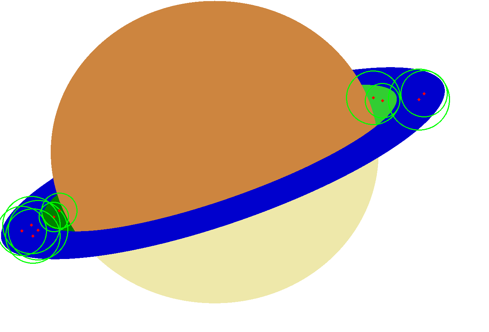
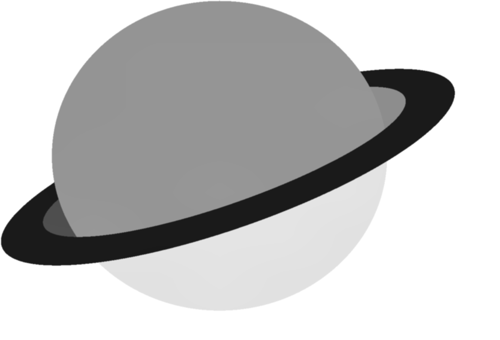
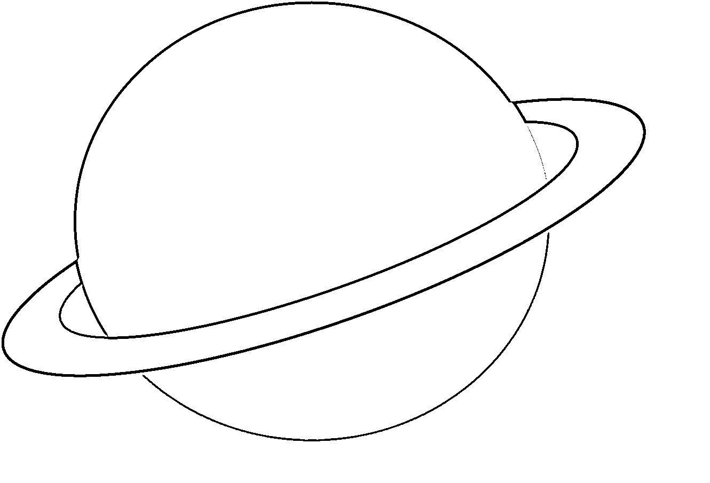

# Circle Detection and Image Enhancement

This project demonstrates the use of OpenCV for image preprocessing and shape detection. The script performs several image processing tasks to detect curves in an image, including:

1. **Brightness and Contrast Adjustment**: Enhances the brightness and contrast of the image.
2. **CLAHE Application**: Applies Contrast Limited Adaptive Histogram Equalization (CLAHE) for contrast enhancement.
3. **Image Preprocessing**: Converts the image to grayscale, applies CLAHE, and smooths the image with Gaussian blur.
4. **Edge Detection**: Uses adaptive thresholding, Sobel operator, and Canny edge detection to identify edges.
5. **Morphological Operations**: Applies dilation and closing to improve edge detection results.
6. **Circle Detection**: Detects circles using the Hough Circle Transform.

## Results

### Original Image with Detected Curves

This image shows the original image with detected curves marked. The circles are highlighted with green circles and red dots at their centers.



### Preprocessed Image

This image shows the grayscale image after applying CLAHE and Gaussian blur.



### Adaptive Thresholding

This image shows the result of applying adaptive thresholding to the preprocessed image to highlight edges.



### Final Edges

This image shows the final edges after combining Sobel and Canny edge detection and applying morphological operations.


## How to Run

1. **Install Dependencies**: Make sure you have the required Python packages installed:

   ```bash
   pip install opencv-python numpy matplotlib
